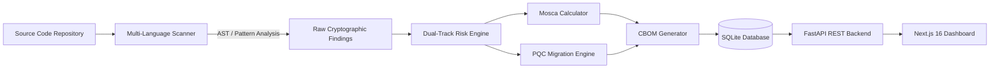
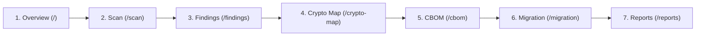

# ECDAT Demo & Evaluation Guide

> **Project:** ECDAT (Enterprise Cryptographic Discovery & Analysis Tool)  
> **Type:** Software Prototype & Technical Demonstration  
> **Project Context:** Developed as a prototype for Smart India Hackathon 2026 (SIH26164 / NTRO)  

---

## 1. Project Overview

Organizations maintain large codebases developed across multiple programming languages and frameworks over extended periods. Inside these repositories:
- Legacy hash functions (e.g., MD5, SHA-1) or outdated ciphers (e.g., DES) may persist in active code paths.
- Security hygiene issues, such as hardcoded credentials or API tokens, may exist directly in source files.
- Classical public-key algorithms (e.g., RSA, ECDSA, Diffie-Hellman) remain common for authentication, digital signatures, and key exchange. While many of these implementations remain secure against classical cryptanalysis today, they face theoretical vulnerability to Shor's algorithm on future cryptanalytically relevant quantum computers.
- Long-lived confidential data faces the "Harvest Now, Decrypt Later" (HNDL) threat model: encrypted communications can be captured today by adversaries and stored until quantum computing capabilities make decryption feasible.

### The Objective
Most organizations lack comprehensive visibility into where cryptography is invoked across their codebases and cannot easily differentiate between urgent present-day vulnerabilities and forward-looking post-quantum migration requirements.

### What ECDAT Provides
ECDAT is an explainable cryptographic discovery and migration-planning prototype. Given a target repository, it:
1. **Discovers cryptographic usage** across source files in Python, JavaScript/TypeScript, and Java.
2. **Separates current security status from quantum migration risk** using a dual-track assessment model.
3. **Applies Mosca's theorem** using configurable planning parameters to organize findings by migration urgency.
4. **Generates a structured Cryptographic Bill of Materials (CBOM)** detailing each asset's source location, algorithm, and risk attributes.
5. **Recommends post-quantum migration directions** informed by NIST standards (such as ML-KEM and ML-DSA).
6. **Visualizes cryptographic dependencies** in an interactive architecture map.

---

## 2. Technical Architecture & Design Principles

### Deterministic & Explainable Policy Logic
Core security classification and migration policy decisions are deterministic and rule-based:
- ECDAT uses explainable static-analysis rules and deterministic policy logic rather than AI-generated security classifications.
- Rules map detected algorithm names, operation types, and key lengths against policy definitions informed by established cryptographic standards, including relevant NIST publications.
- Every finding includes direct provenance: source file, line number, code snippet, detecting rule identifier, and policy citation.

### Core Components
1. **Multi-Language Static Discovery:**
   - **Python:** Analyzes Abstract Syntax Trees (`ast` module) to inspect function calls, keyword arguments, and import aliases without executing untrusted code.
   - **JavaScript / TypeScript:** Rule-based pattern matching over standard library imports, Web Crypto APIs, Node `crypto` modules, and CryptoJS calls.
   - **Java:** Pattern matching over standard Java Cryptography Architecture (`java.security`, `javax.crypto`) usage, Cipher transformation strings, and key generators.
2. **Dual-Track Risk Model:**
   - Instead of a single generic severity score, findings are evaluated across two separate dimensions:
     - **Current Security Status:** Broken, Deprecated, Acceptable, Strong.
     - **Quantum Risk Status:** Vulnerable, Migration Concern, Low Concern, Not Applicable.
3. **Mosca-Style Migration Prioritization:**
   - Evaluates the inequality: $\text{Urgency} = X + Y - Z$
     - $X$ = Required data security lifetime (years)
     - $Y$ = Estimated time to re-architect and migrate the system (years)
     - $Z$ = Configurable quantum threat horizon/scenario (years)
   - When $X + Y > Z$, migration planning urgency increases. The threat horizon $Z$ is treated as a configurable scenario assumption, **not a prediction** of when a quantum computer will arrive.
4. **Structured CBOM:**
   - Generates an inventory of detected cryptographic assets with source attribution, exportable to JSON and CSV formats.

---

## 3. Technical Walkthrough & Evaluation Sequence

When evaluating the prototype, the following walkthrough order demonstrates the core capabilities:

### Step 1: Dashboard Overview (`/`)
- **Focus:** High-level inventory metrics: Total Findings, Current Criticals, Quantum Migration Concerns, Scanned Files, and Scan Duration.
- **Key Observation:** Current criticals (immediate classical issues) and quantum migration concerns (forward-looking post-quantum concerns) are tracked side-by-side.

### Step 2: Scan Initiation (`/scan`)
- **Focus:** Triggering a scan via "Scan Demo Repository".
- **Key Observation:** The background engine creates a snapshot of target files, executes static scanners across worker threads, streams stage transitions (Scanning → Assessing Risk → Generating CBOM → Completed), and stores results in the SQLite database.
- **Note:** Supports local directory paths and ZIP uploads with safety constraints (expansion ratio limits and path traversal checks).

### Step 3: Findings Explorer (`/findings`)
- **Focus:** Examining specific findings with expanded detail panels.
- **Exemplar Comparison (Dual-Track Model):**
  - **MD5 Finding (`python_app/hasher.py:10`):**
    - Current Security: **Broken** (collision resistance broken classically).
    - Quantum Risk: **Not Applicable** (a quantum computer is not required to compromise MD5).
  - **RSA-2048 Finding (`python_app/auth.py:23`):**
    - Current Security: **Acceptable** (remains secure against classical cryptanalysis today).
    - Quantum Risk: **Vulnerable / Migration Concern** (theoretically susceptible to Shor's algorithm).
- **Detail View Elements:** File path, line number, code snippet, scanner rule ID, policy reference, and recommended migration direction.

### Step 4: Interactive Architecture Map (`/crypto-map`)
- **Focus:** The React Flow graph visualization.
- **Key Observation:** Visualizes the relationship from the application root through directories and source files down to individual cryptographic primitives, colored by risk tier.

### Step 5: Cryptographic Bill of Materials (`/cbom`)
- **Focus:** The structured cryptographic inventory table.
- **Key Observation:** Tabular inventory providing algorithm, library, operation type, key size, source location, current risk, quantum risk, and migration priority. Data is sortable and searchable.

### Step 6: Migration Roadmap (`/migration`)
- **Focus:** Grouped prioritization tiers: **Act Now**, **Plan Migration**, **Monitor**, and **No Urgent Action**.
- **Key Observation:** Findings are organized by Mosca urgency. Algorithms map to modern post-quantum directions informed by NIST standards:
  - *Digital Signatures (RSA, ECDSA)* $\rightarrow$ **ML-DSA** (NIST FIPS 204) or **SLH-DSA** (NIST FIPS 205).
  - *Key Establishment / Exchange* $\rightarrow$ **ML-KEM** (NIST FIPS 203) or hybrid key-establishment schemes.

### Step 7: Reports & Export (`/reports`)
- **Focus:** Exporting analysis data.
- **Key Observation:** Provides structured JSON and CSV downloads for integration into external auditing tools or reporting pipelines.

---

## 4. Frequently Asked Technical Questions

### Q1: How does this differ from general-purpose static analysis tools?
> General-purpose SAST tools identify common security vulnerabilities and known CVEs, but typically treat cryptographic primitives as generic findings (such as flagging MD5 as an insecure hash). They generally do not evaluate post-quantum readiness, do not track quantum risk separately from classical risk, do not implement Mosca-style timeline evaluation, and do not produce structured cryptographic inventories (CBOMs) with post-quantum migration directions. ECDAT is specifically designed for cryptographic asset discovery and quantum transition planning.

### Q2: Does ECDAT use machine learning or LLMs for security decisions?
> No. Core security classifications, risk ratings, and migration recommendations are deterministic and rule-based. They are driven by an explicit YAML policy informed by established cryptographic standards, including relevant NIST publications. This ensures consistent, reproducible results and clear auditability.

### Q3: Why is quantum risk relevant if practical quantum computers are not yet deployed?
> Because of the "Harvest Now, Decrypt Later" threat model. If sensitive data must maintain legal or operational confidentiality for 10–20 years, and system migration requires several years of planning and re-engineering, exposure to future quantum decryption begins immediately for data transmitted today using classical public-key cryptography. This is why organizations such as NIST have published post-quantum standards (FIPS 203, 204, and 205).

### Q4: What are the current limitations of the static scanner?
> The prototype focuses on source-code static analysis. Python uses AST-based parsing with import alias tracking, while JavaScript and Java currently use regex- and pattern-based heuristic scanners, which may produce false positives or false negatives in complex codebases. Compiled binaries, container images, dynamic runtime behavior, and live network/TLS handshakes are not scanned by the current prototype.

---

## 5. Verified Prototype Metrics

The following metrics are verified directly against the bundled demo codebase (`demo_repository/`):

| Metric | Verified Value |
|---|---|
| Bundled demo findings | ~50 findings |
| Files scanned | 10 files |
| Languages scanned | Python, JavaScript, Java |
| Bundled demo scan duration | ~0.55 seconds |
| Backend test suite | 91 passed (`pytest`) |
| Frontend test suite | 28 passed (`node --test`) |
| Frontend production build | ✅ Clean (0 TypeScript errors) |
| Standards referenced | NIST SP 800-131A Rev. 2, NIST FIPS 203, 204, 205, CNSA 2.0 |
| Persistence | SQLite via SQLAlchemy |
