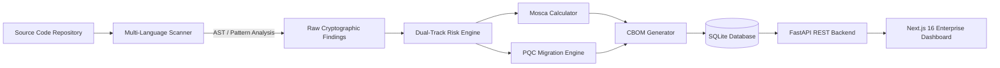
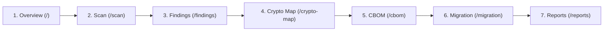

# ECDAT — Hackathon Presentation & Judge Showcase Master Guide

> **Project Name:** ECDAT (Enterprise Cryptographic Discovery & Analysis Tool)  
> **Target Event:** Smart India Hackathon (SIH) 2026  
> **Core Category:** Cyber Security / Post-Quantum Cryptography (PQC) / DevSecOps  

---

## 1. Executive Summary: What is ECDAT in Simple Terms?

Imagine a bank, telecom operator, or government agency with millions of lines of code accumulated over 15 years.
Inside that code:
- Some developers used **MD5** or **SHA-1** to hash passwords (broken today).
- Some hardcoded database credentials or API tokens directly in source files (security hygiene violation).
- Some used **RSA-2048** or **ECDSA** for digital signatures or encryption. While RSA-2048 is secure against today's standard laptops and supercomputers, **it will be broken when Cryptanalytically Relevant Quantum Computers (CRQCs) arrive via Shor's Algorithm**.
- Organizations also face **Harvest Now, Decrypt Later (HNDL)**: adversaries intercept and store encrypted confidential communication *today*, waiting for quantum computers *tomorrow* to decrypt it.

### The Problem
Organizations **do not know what cryptography they are using, where it is located, or which systems need migration first**.

### What ECDAT Does
ECDAT is an automated static discovery and risk analysis tool. You point it at a repository (or upload a ZIP), and it:
1. **Finds all cryptographic primitives** and hardcoded secrets across multiple languages.
2. **Separates current-day risk from quantum risk** (a critical distinction).
3. **Applies Mosca's Theorem** to calculate whether you need to migrate *now* or can afford to *monitor*.
4. **Generates a Cryptographic Bill of Materials (CBOM)**—the cryptography equivalent of an SBOM.
5. **Maps modern Post-Quantum Cryptography (PQC) alternatives** based on NIST FIPS standards (e.g., ML-KEM, ML-DSA).
6. **Renders an interactive dependency graph** and enterprise dashboard.

---

## 2. Core Architecture & Why Judges Will Love It

### The 100% Deterministic Rule-Based Engine (NO LLM Hallucinations)
A huge selling point for cybersecurity judges:
> *"We do NOT use an LLM or generative AI to make security risk assessments or cryptographic classifications. All detections, risk levels, and migration directions are 100% deterministic, explainable, and traceable to NIST SP 800-131A, CNSA 2.0, and NIST FIPS 203/204/205 standards."*

### Key Technical Pillars:
1. **Multi-Language AST & Static Extraction:**
   - **Python:** Uses native Python AST (`ast` module) to inspect AST nodes, function calls, keyword arguments, and direct variable assignments. It doesn't just regex match; it parses the syntax tree.
   - **JavaScript / TypeScript:** Scans crypto imports, Web Crypto APIs, Node `crypto` modules, and CryptoJS calls.
   - **Java:** Identifies `java.security`, `javax.crypto`, Cipher instance strings, and padding configurations.
2. **Dual-Track Risk Classification:**
   - Most security tools lump everything into generic "High/Medium/Low" CVE severity.
   - ECDAT splits evaluation into **two orthogonal axes**:
     - **Current Security Status:** Broken, Deprecated, Acceptable, Strong.
     - **Quantum Risk Status:** Vulnerable, Migration Concern, Low Concern, Not Applicable.
3. **Mosca's Theorem Engine:**
   - Formula: $\text{Urgency} = X + Y - Z$
     - $X$ = Shelf-life / Data secrecy requirement (years)
     - $Y$ = Migration time to re-engineer infrastructure (years)
     - $Z$ = Threat horizon / time until a practical quantum computer exists (years)
   - If $X + Y > Z$, the system is **already in danger** due to Harvest Now, Decrypt Later!
4. **CBOM (Cryptographic Bill of Materials):**
   - Compliant with emerging supply-chain security standards (NIST IR 8547 / CycloneDX extensions).
   - Traceable directly to file path, line number, and code snippet.

---

## 3. The 3-Minute Hackathon Pitch Script

*Use this structure when pitching in front of the judges booth or stage:*

### [0:00 - 0:45] The Hook & Problem
> *"Good morning respected judges. Every enterprise is currently blind to its own cryptographic attack surface. If I ask a CTO today: 'How many RSA-1024 or MD5 instances exist in your legacy repositories?' they have to spend weeks doing manual audits. Even worse, nation-state actors are executing 'Harvest Now, Decrypt Later' attacks against encrypted data that must remain confidential for 10 to 20 years.*  
> *When quantum computers break RSA and ECC, organizations will scramble. We built **ECDAT: Enterprise Cryptographic Discovery & Analysis Tool** to solve this visibility crisis today."*

### [0:45 - 1:45] What We Built & Live Demo Hook
> *"ECDAT is a full-stack, enterprise-grade cryptographic discovery platform. It statically analyzes codebases across Python, Java, and JavaScript without executing potentially untrusted code.*  
> *Unlike generic SAST tools, ECDAT does not conflate classical risk with quantum risk. For example, MD5 is broken today classically, but quantum-irrelevant. Conversely, RSA-2048 is completely secure today, but an existential quantum vulnerability.*  
> *Let us show you a live scan on our test repository containing ~50 cryptographic patterns."*

### [1:45 - 2:30] Showing Key Features
> *(Point to the screen)*  
> *"1. Here is our **Scan Engine** showing real-time pipeline telemetry across AST parsing, risk engine, and CBOM generation.*  
> *2. On the **Findings Page**, every single cryptographic usage shows exact code provenance, the detecting policy rule, and dual-axis risk.*  
> *3. Under **CBOM**, we export an enterprise-standard Cryptographic Bill of Materials in JSON and CSV.*  
> *4. In the **Crypto Map**, React Flow renders the interactive architectural dependency graph showing how crypto is distributed across modules.*  
> *5. And in our **Migration Roadmap**, we use Mosca's inequality to prioritize remediation into Act Now, Plan Migration, and Monitor tiers, pointing developers directly to NIST-standardized Post-Quantum algorithms like ML-KEM and ML-DSA."*

### [2:30 - 3:00] Business Value & Closing
> *"All of this runs deterministically without hallucinations, backed by a FastAPI async core, SQLAlchemy persistence, and a responsive Next.js 16 frontend. ECDAT gives cybersecurity teams cryptographic agility before quantum decryption becomes a reality. Thank you!"*

---

## 4. Feature-by-Feature Showcase Guide (What to Click During the Demo)

When demonstrating the UI, click through the tabs in this exact sequence:

### 1. Dashboard Overview (`/`)
- **What to show:** The top executive KPI cards (Total Findings, Critical Findings, Quantum Migration Concerns, Scanned Files).
- **What to say:** *"This gives the CISO an instant snapshot of the cryptographic health and quantum posture of the application."*
- **Highlight:** Point out that **Quantum Migration Concerns** and **Current Criticals** are displayed side-by-side to emphasize the dual-track risk.

### 2. Scan Repository (`/scan`)
- **What to show:** Click **"Scan Demo Repository"**.
- **What to say:** *"Notice that this is not a mock or fake loader. The backend is spinning up worker threads, snapshotting the files, executing AST parsers, applying the YAML risk policy, and streaming progress."*
- **Highlight:** Mention that it supports local path scanning and ZIP archive uploads with built-in zip-bomb defense limits (max expansion ratio 100:1, traversal checks).

### 3. Findings Explorer (`/findings`)
- **What to show:** Expand an **MD5** finding, then expand an **RSA-2048** finding.
- **What to say:**
  - *"Look at MD5: Current Security is **Broken**, Quantum Risk is **Not Applicable** (no need for a quantum computer to break MD5!)."*
  - *"Now look at RSA-2048: Current Security is **Strong/Acceptable**, but Quantum Risk is **Vulnerable / Migration Concern**."*
- **Highlight:** Open the detail drawer to show the **10-point evidence view**: file, line number, code snippet, rule ID, NIST policy reference, and recommended replacement.

### 4. Crypto Map (`/crypto-map`)
- **What to show:** Pan and zoom the React Flow graph.
- **What to say:** *"Architects need to see how cryptography is clustered. This interactive graph connects root applications to directories, source files, and leaf cryptographic primitives, colored by risk severity."*

### 5. CBOM (`/cbom`)
- **What to show:** The searchable, sortable Cryptographic Bill of Materials table.
- **What to say:** *"Just like modern software supply chains require an SBOM for libraries, upcoming cybersecurity mandates require a CBOM for cryptography. Every entry is exportable to JSON and CSV."*

### 6. Migration Plan (`/migration`)
- **What to show:** The four urgency tiers (**Act Now**, **Plan Migration**, **Monitor**, **No Urgent Action**).
- **What to say:** *"How does an enterprise prioritize what to fix first? We implement **Mosca's Theorem**. If your data shelf-life plus migration duration exceeds the quantum threat horizon, it lands in 'Act Now'."*
- **Highlight:** Point out the algorithm-specific replacement recommendations:
  - *RSA for Key Exchange* $\rightarrow$ **ML-KEM (Kyber / FIPS 203)**
  - *RSA / ECDSA for Signatures* $\rightarrow$ **ML-DSA (Dilithium / FIPS 204)**
  - *Stateless Hash-based Signatures* $\rightarrow$ **SLH-DSA (SPHINCS+ / FIPS 205)**

### 7. Reports & Export (`/reports`)
- **What to show:** Click "Download CBOM (CSV)" or "Download Full Report (JSON)".
- **What to say:** *"Security auditors can immediately ingest this data into their enterprise GRC or SIEM tools."*

---

## 5. Winning Answers to Anticipated Judge Questions

### Q1: "Why not just use SonarQube, Semgrep, or Snyk?"
> **Your Answer:**  
> *"Generic SAST tools are great at finding general bugs and known CVEs, but they fail at post-quantum readiness. They treat cryptography as an afterthought—flagging MD5 as a weak hash, but completely ignoring RSA-2048 because RSA-2048 has no CVE today. They do not calculate quantum threat horizons, they do not evaluate Mosca's equation, and they cannot generate a specialized Cryptographic Bill of Materials (CBOM) with PQC migration roadmaps. ECDAT is purpose-built for cryptographic discovery and quantum agility."*

### Q2: "Are you using an LLM to detect these vulnerabilities?"
> **Your Answer:**  
> *"No, and that is an intentional design choice. Cryptographic compliance requires **100% determinism, zero hallucinations, and explainable audit trails**. If a bank audits their codebase, an LLM could give different answers on different days. ECDAT uses AST parsing and deterministic rule engines mapped directly to NIST SP 800-131A and CNSA 2.0 standards. LLMs could optionally be used later only to draft developer pull-request summaries, never to decide cryptographic risk."*

### Q3: "Is the quantum threat really urgent today if quantum computers don't exist yet?"
> **Your Answer:**  
> *"Yes, because of **Harvest Now, Decrypt Later (HNDL)**. If a healthcare system or defense contractor has data that must remain legally confidential for 15 years ($X=15$), and re-architecting their enterprise takes 5 years ($Y=5$), their timeline is 20 years. If a quantum computer capable of breaking RSA arrives in 12 years ($Z=12$), their data is already vulnerable today ($15 + 5 - 12 = +8$ years of exposure). That is why NIST released FIPS 203, 204, and 205 in August 2024, and why government agencies are mandating PQC inventories now."*

### Q4: "How do you avoid false positives and false negatives?"
> **Your Answer:**  
> *"For Python, we use the Abstract Syntax Tree (AST), which inspects the syntactic structure of code rather than naive text matching. For example, it tracks function calls and argument keywords. We also report confidence ratings (High, Medium, Low) and separate true cryptographic primitives from general 'security hygiene' findings like hardcoded passwords. We also explicitly disclose our current limitations: we focus on source code static analysis, not dynamic runtime memory or binary analysis."*

### Q5: "What are your future plans to make this a commercial product?"
> **Your Answer:**  
> *"1. Expanding AST scanners to Go, Rust, and C/C++ (crucial for embedded firmware and kernel modules).  
> 2. Integrating directly into GitHub Actions / GitLab CI/CD pipelines to block PRs introducing deprecated algorithms.  
> 3. Standardizing CBOM output with CycloneDX v1.6 cryptographic extensions.  
> 4. Automated remediation: generating pull requests that swap legacy crypto calls with PQC library wrappers (like liboqs or BouncyCastle PQC)."*

---

## 6. Quick Cheat Sheet for Demo Day

| Metric / Fact | Number / Value |
|---|---|
| **Demo Repository Findings** | ~50 real findings discovered dynamically |
| **Languages Supported** | Python (AST), JavaScript/TypeScript (Regex/Node/WebCrypto), Java (Cipher/JCA) |
| **Backend Tests** | 91 passing tests (pytest) |
| **Frontend Tests** | 28 passing unit tests |
| **TypeScript / Build Errors** | 0 errors, static Next.js production build |
| **Standards Mapped** | NIST SP 800-131A, CNSA 2.0, FIPS 203 (ML-KEM), FIPS 204 (ML-DSA), FIPS 205 (SLH-DSA) |
| **Persistence** | SQLite with SQLAlchemy ORM + localStorage rehydration |
| **API Endpoints** | 14 REST endpoints documented in OpenAPI / Swagger (`/docs`) |
