# ECDAT — Enterprise Cryptographic Discovery & Analysis Tool

ECDAT is a local, explainable static-analysis prototype for discovering cryptographic usage in source repositories. It builds a Cryptographic Bill of Materials (CBOM), separates present-day security issues from quantum-migration exposure, and provides mitigation and migration planning without claiming automatic remediation.

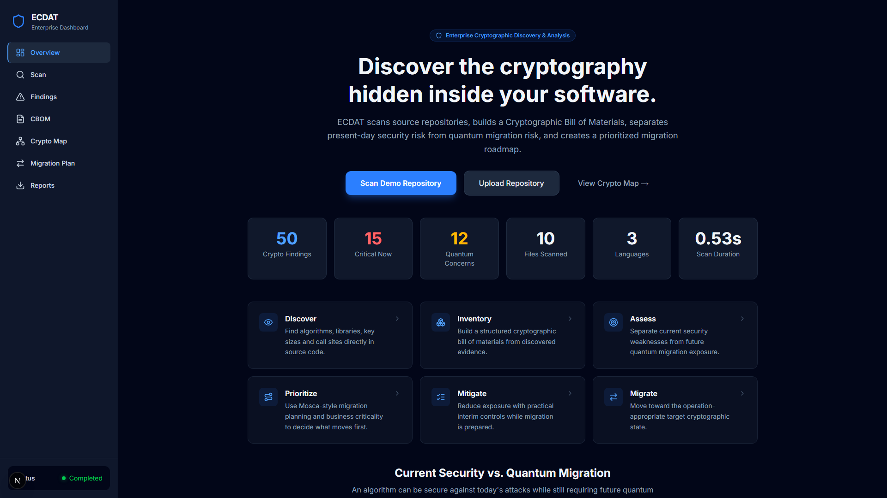

> The metrics and images below are from the bundled multi-language demo repository. They are reproducible demonstration results, not general performance benchmarks.

## The problem

Cryptography is distributed through application code, legacy utilities, and credentials. A single severity label is insufficient: MD5 can be broken today, while a correctly configured RSA-2048 use can be acceptable today but require post-quantum planning. ECDAT makes both dimensions visible.

## Lifecycle

`DISCOVER → INVENTORY → ASSESS → PRIORITIZE → MITIGATE → MIGRATE`

- **Discover:** Python AST/import-alias analysis plus JavaScript/TypeScript and Java heuristic scanners identify static call sites without executing target code.
- **Inventory:** an evidence-bearing CBOM retains source-relative path, line, snippet, algorithm, operation, key size where extracted, and rule metadata.
- **Assess:** deterministic policy produces independent current-security and quantum-risk status.
- **Prioritize:** Mosca-style `X + Y − Z` planning uses configurable scenario assumptions; the threat horizon is not a forecast.
- **Mitigate:** interim, human-reviewed controls; local checklist selection is not verified remediation.
- **Migrate:** operation-aware direction toward ML-KEM/reviewed hybrid key establishment or ML-DSA/approved PQ signatures.

## Showcase

<details open><summary><strong>Discovery and investigation</strong></summary>

| Overview | Explainer | Completed demo scan |
| --- | --- | --- |
|  | 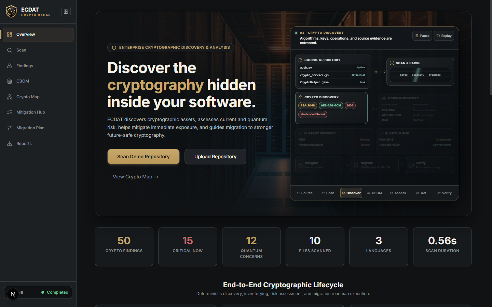 | 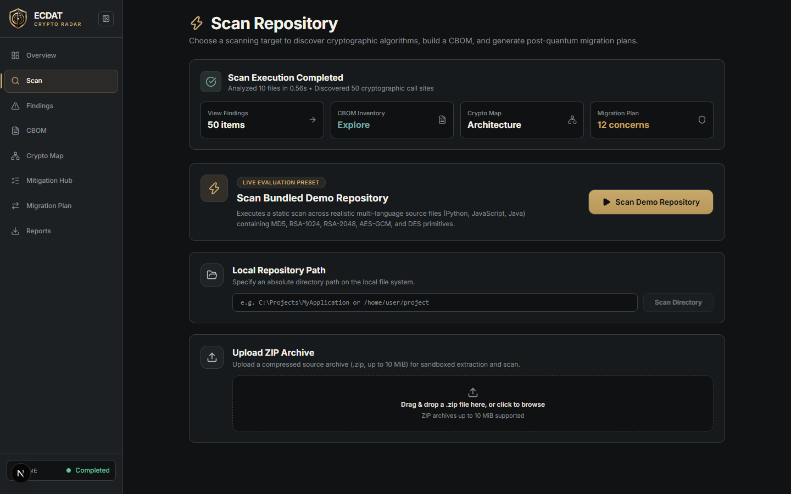 |

| Findings explorer | MD5 evidence | RSA dual risk |
| --- | --- | --- |
|  | 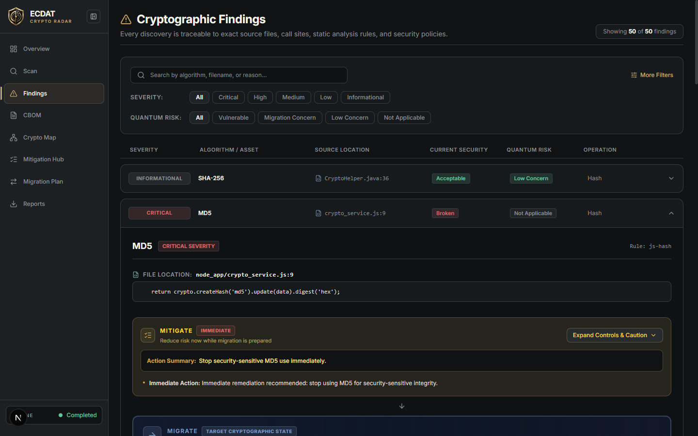 | 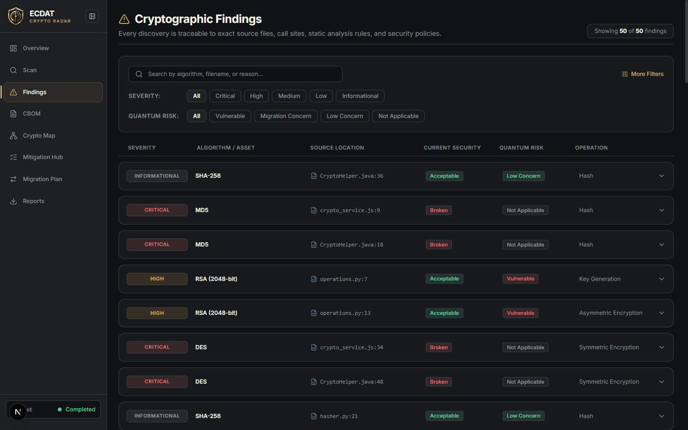 |
</details>

<details><summary><strong>Mitigation and migration</strong></summary>

| Mitigation Hub | Migration roadmap |
| --- | --- |
| 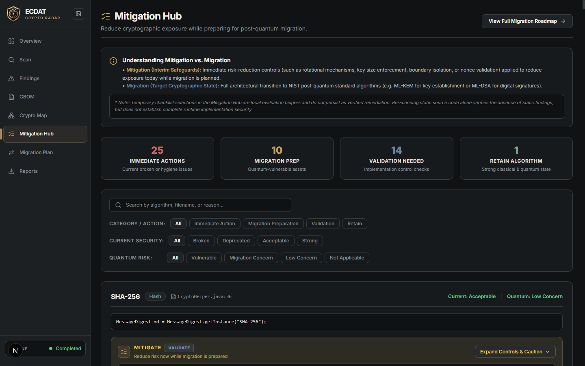 | 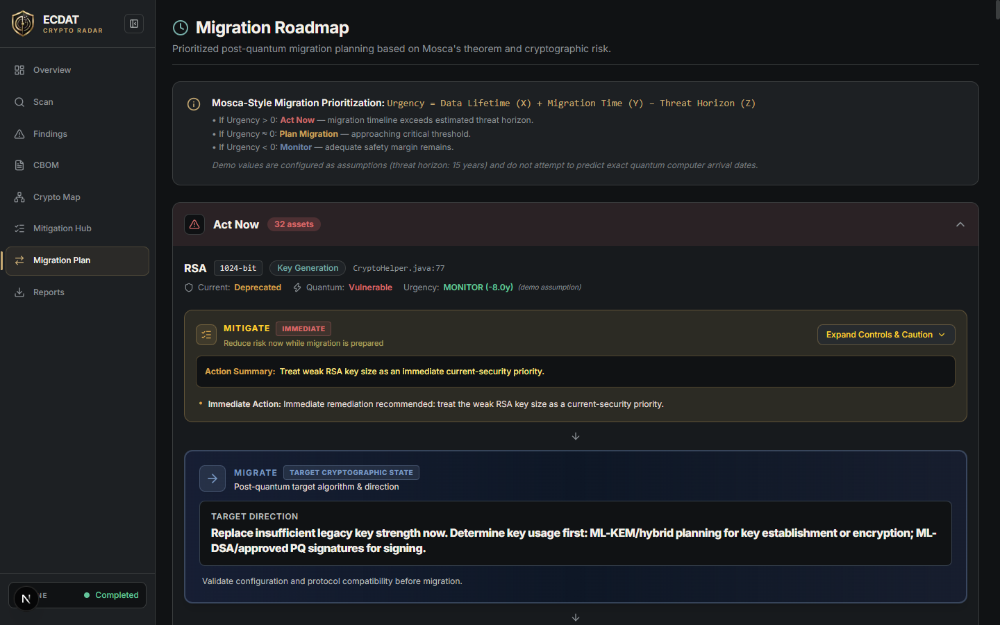 |
</details>

<details><summary><strong>Inventory, architecture, and exports</strong></summary>

| CBOM exposure map |
| --- |
| 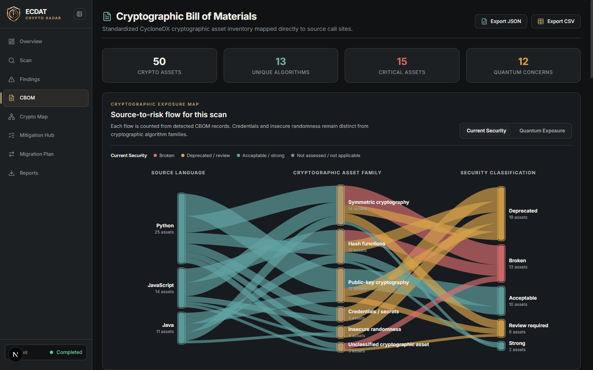 |

| Architecture overview | Expanded Crypto Map | Reports and exports |
| --- | --- | --- |
| 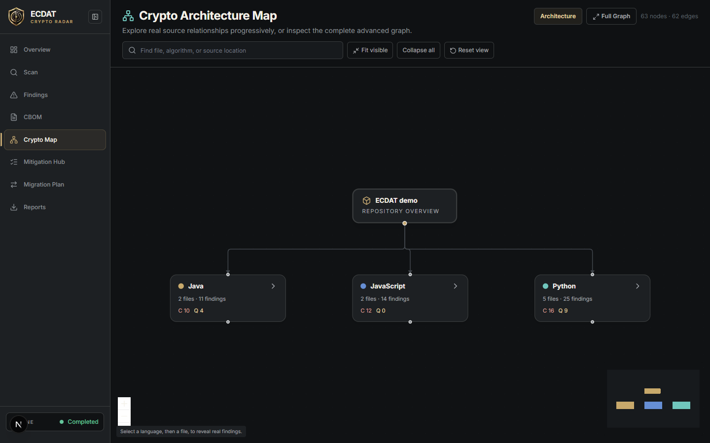 | 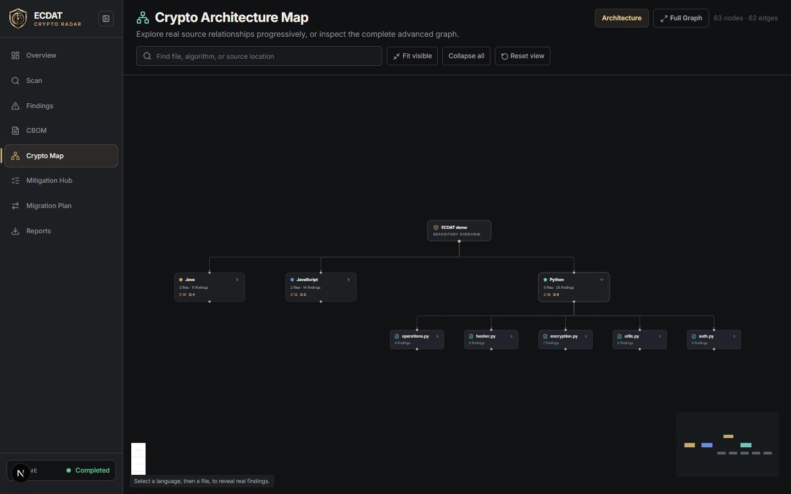 | 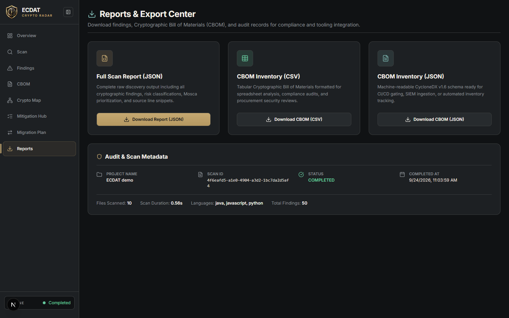 |
</details>

## Verified bundled-demo result

The fresh scan used for this showcase completed with **10 files**, **50 findings**, **15 current critical findings**, **12 quantum migration concerns**, **13 distinct algorithm labels**, **63 graph nodes**, and **62 graph edges**. The scanner covered Python, JavaScript, and Java. These categories overlap by design: an RSA occurrence may be quantum-vulnerable without being a present-day critical finding.

See the complete, source-backed [feature inventory](docs/FEATURE_INVENTORY.md).

## Interactive feature states

| Findings filter | CBOM quantum view | Mitigation controls |
| --- | --- | --- |
| 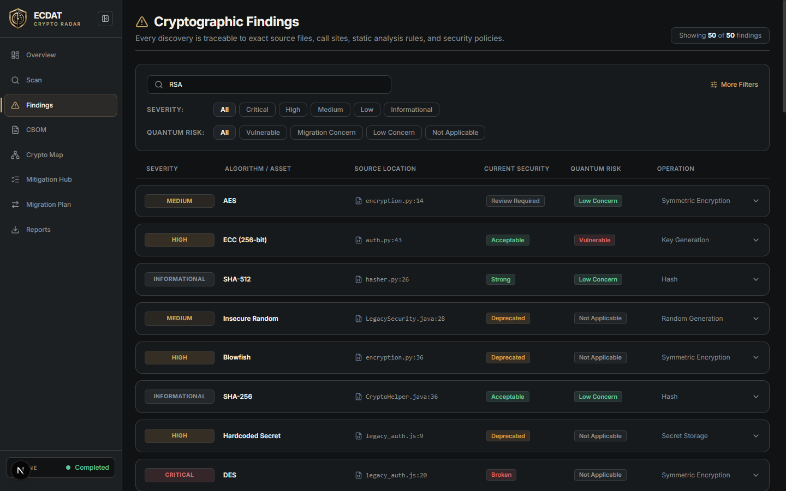 | 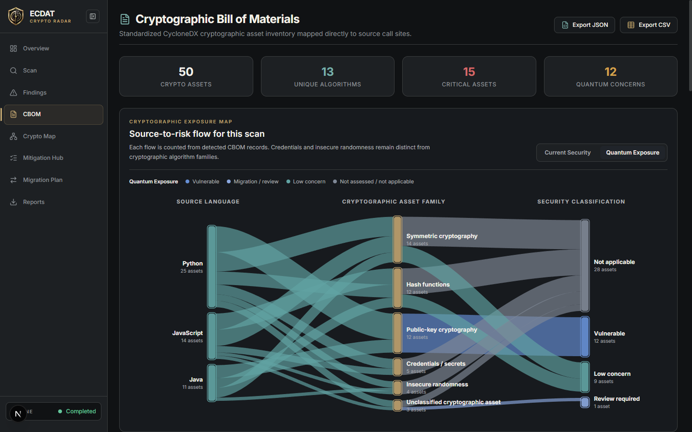 | 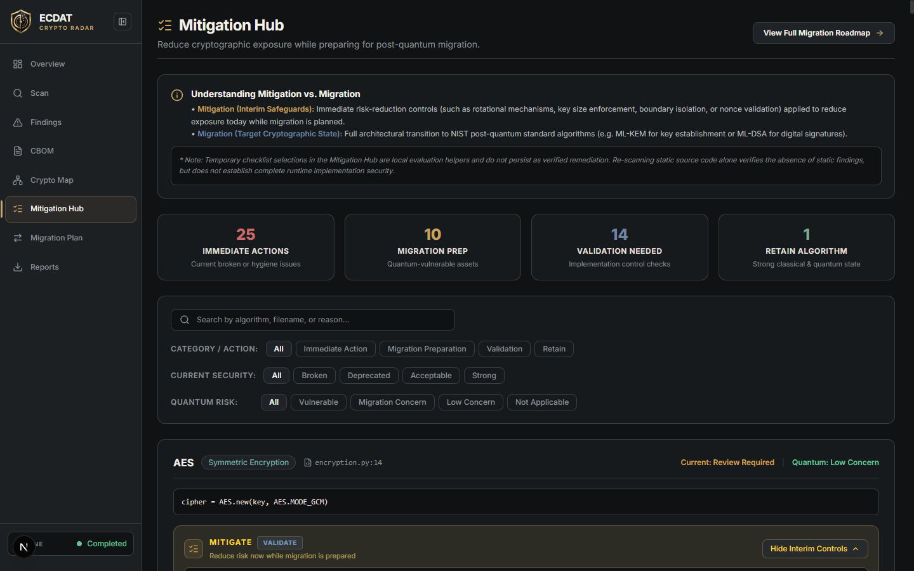 |

| Full Crypto Map | Compact responsive view | System architecture |
| --- | --- | --- |
|  | 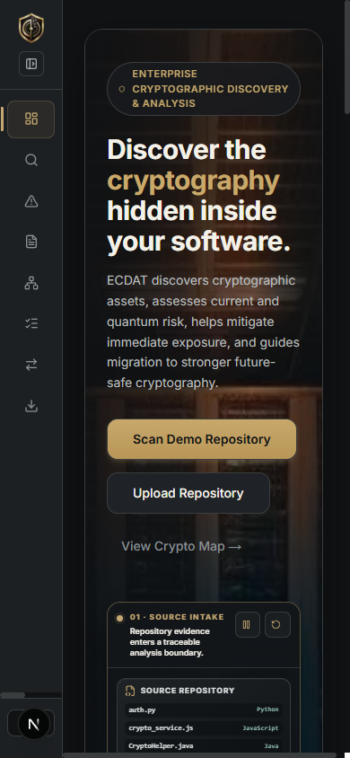 | 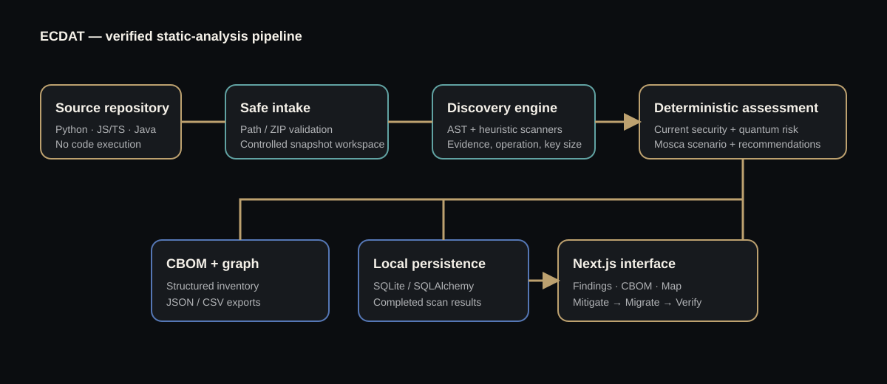 |

The CBOM comparison component also supports grouped-bar and dumbbell views with category filtering. Its supporting capture and the complete mapping are recorded in the [feature coverage matrix](docs/FEATURE_COVERAGE_MATRIX.md).

## Architecture and stack

| Layer | Implementation |
| --- | --- |
| API and persistence | FastAPI, Pydantic, SQLAlchemy, local SQLite |
| Static discovery | Python AST; JavaScript/TypeScript and Java pattern scanners |
| Policy and planning | YAML-backed deterministic risk rules, Mosca calculator, operation-aware recommendation engine |
| Frontend | Next.js 16, React 19, TypeScript, Tailwind CSS |
| Visualization | Recharts, custom SVG exposure map, React Flow |

## Run locally

Prerequisites: Python 3.12+, Node.js 20+, and npm.

```powershell
# repository root
python -m venv .venv
.\.venv\Scripts\python -m pip install -r backend\requirements.txt
.\.venv\Scripts\python -m uvicorn app.main:app --app-dir backend --host 127.0.0.1 --port 8000
```

```powershell
# another terminal
cd frontend
npm install
npm run build
npm start -- -p 3000
```

Open http://localhost:3000, then select **Scan Demo Repository**. The health endpoint is http://localhost:8000/api/health and Swagger is http://localhost:8000/docs.

## Validate

```powershell
# repository root
.\.venv\Scripts\python -B -m pytest -q -p no:cacheprovider

# frontend
cd frontend
npm test
npm run build
npm run lint
```

The audited state passed 100 backend tests, 47 frontend tests, and the production build. Lint still reports the pre-existing `react-hooks/set-state-in-effect` rule in `frontend/hooks/use-scan.ts`; it is not suppressed here.

## Scope and limitations

- Static source analysis only: no runtime, binary, container, certificate-store, live TLS, or network-traffic discovery.
- JavaScript/TypeScript and Java scanners are heuristic; Python is AST-based but not whole-program/inter-procedural dataflow.
- The project CBOM exports JSON/CSV but is not claimed to be certified CycloneDX compliant.
- Re-scanning validates static findings after external remediation; it cannot prove runtime security. ECDAT does not modify customer code.
- Local SQLite persistence and unauthenticated loopback API are for local evaluation, not a multi-tenant deployment.

## References and project context

ECDAT is a Smart India Hackathon 2026 prototype (SIH26164 / NTRO). Its policy and migration terminology reference NIST SP 800-131A Rev. 2, FIPS 203 (ML-KEM), FIPS 204 (ML-DSA), FIPS 205 (SLH-DSA), CNSA 2.0, and Mosca-style migration planning. See [docs/API.md](docs/API.md) and [DEMO_GUIDE.md](DEMO_GUIDE.md) for endpoint and demonstration details.
