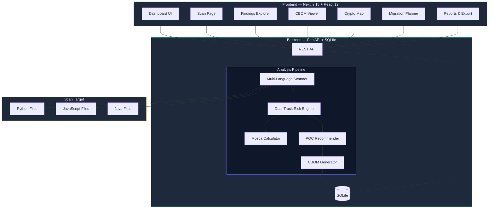

<p align="center">
  <h1 align="center">ECDAT — Enterprise Cryptographic Discovery & Analysis Tool</h1>
  <p align="center">
    <strong>Smart India Hackathon 2026</strong><br/>
    Static cryptographic discovery · Dual-track risk assessment · Post-quantum migration planning · CBOM export
  </p>
</p>

---

## Problem Statement

Organizations rely on cryptographic primitives — hash functions, ciphers, key exchange protocols, digital signatures — embedded across thousands of source files, often using outdated or vulnerable algorithms without awareness. As quantum computing advances, even currently secure algorithms (RSA, ECC, Diffie-Hellman) face existential threats from Shor's algorithm.

**The challenge:** Most organizations have no inventory of the cryptographic primitives actually used in their codebases, cannot distinguish between present-day weaknesses and future quantum threats, and have no structured path toward post-quantum migration.

**ECDAT solves this** by scanning source code repositories, building a complete cryptographic inventory, separating current-security risk from quantum-risk, computing migration urgency using Mosca's theorem, and generating actionable migration roadmaps — all through deterministic, explainable, rule-based analysis with zero reliance on LLMs for security decisions.

> [!IMPORTANT]
> This is a **functional end-to-end proof-of-concept** built for SIH 2026. It demonstrates the complete workflow from scan to migration roadmap. It is not production-hardened software.

---

## Architecture



---

## Key Capabilities

| Capability | Description |
|---|---|
| **Multi-Language Scanning** | AST-based Python scanner, regex-based JavaScript/TypeScript and Java scanners detect cryptographic usage patterns across codebases |
| **Dual-Track Risk Assessment** | Separates **current security status** (broken/deprecated/acceptable/strong) from **quantum risk status** (vulnerable/migration concern/low concern) — these are independent axes |
| **Mosca's Theorem** | Computes migration urgency: if `data_lifetime + migration_time > threat_horizon`, you must act now. Values are configurable planning assumptions, **not predictions** |
| **PQC Migration Recommendations** | Maps each finding to NIST-approved post-quantum alternatives (ML-KEM for key exchange, ML-DSA for signatures, SLH-DSA for stateless signatures) |
| **CBOM Generation** | Produces a Cryptographic Bill of Materials with full provenance — every entry traceable to file, line number, and code snippet |
| **Interactive Crypto Map** | Visual dependency graph showing application → directory → file → finding relationships using React Flow |
| **Export** | JSON and CSV export of complete CBOM data |
| **Deterministic Analysis** | All security decisions are rule-based using YAML policy derived from NIST SP 800-131A and CNSA 2.0 guidance. No LLM makes security classifications |

---

## Verified Demo Metrics

These numbers are from a real scan of the bundled `demo_repository/` — not hardcoded:

| Metric | Value |
|---|---|
| Total findings | ~50 |
| Languages scanned | Python, JavaScript, Java |
| Backend tests passing | 91 |
| Frontend tests passing | 28 |
| TypeScript errors | 0 |
| Production build | ✅ Successful |

---

## Tech Stack

### Backend
- **Python 3.12+** with **FastAPI** — async REST API
- **SQLAlchemy** — SQLite persistence
- **Pydantic v2** — data validation and serialization
- **PyYAML** — risk policy configuration
- **AST module** — Python cryptographic pattern detection

### Frontend
- **Next.js 16** with App Router
- **React 19** + **TypeScript**
- **Tailwind CSS** — utility-first styling
- **Recharts** — data visualization charts
- **React Flow** (`@xyflow/react`) — interactive crypto dependency map
- **Lucide React** — icon library

---

## Project Structure

```
ecdat/
├── backend/
│   ├── app/
│   │   ├── scanner/         # Multi-language crypto scanners
│   │   │   ├── python_scanner.py    # AST-based Python analysis
│   │   │   ├── js_scanner.py        # Regex-based JS/TS analysis
│   │   │   ├── java_scanner.py      # Regex-based Java analysis
│   │   │   ├── engine.py            # Scanner orchestration
│   │   │   └── rule_registry.py     # Scanner rule definitions
│   │   ├── risk/
│   │   │   ├── engine.py            # Dual-track risk engine
│   │   │   └── risk_policy.yaml     # NIST/CNSA-based policy rules
│   │   ├── recommendations/
│   │   │   ├── engine.py            # PQC recommendation engine
│   │   │   └── mosca.py             # Mosca's theorem calculator
│   │   ├── cbom/
│   │   │   └── generator.py         # CBOM generation
│   │   ├── core/
│   │   │   └── models.py            # Pydantic data models
│   │   ├── api/
│   │   │   ├── config.py            # Application configuration
│   │   │   ├── database.py          # SQLAlchemy persistence
│   │   │   └── service.py           # Scan service orchestration
│   │   ├── main.py                  # FastAPI application factory
│   │   └── pipeline.py              # End-to-end scan pipeline
│   ├── tests/                       # 91 backend tests
│   └── requirements.txt
├── frontend/
│   ├── app/
│   │   ├── page.tsx                 # Dashboard overview
│   │   ├── scan/page.tsx            # Scan initiation
│   │   ├── findings/page.tsx        # Findings explorer
│   │   ├── cbom/page.tsx            # CBOM viewer
│   │   ├── crypto-map/page.tsx      # Interactive dependency graph
│   │   ├── migration/page.tsx       # Migration roadmap
│   │   └── reports/page.tsx         # Reports & export
│   ├── components/                  # Shared UI components
│   ├── hooks/                       # React hooks (useScan)
│   ├── lib/                         # API client, display formatting
│   ├── types/                       # TypeScript type definitions
│   └── tests/                       # 28 frontend tests
├── demo_repository/                 # Deliberately vulnerable test code
│   ├── python_app/                  # MD5, DES, weak RSA, hardcoded secrets
│   ├── node_app/                    # RC4, deprecated APIs, legacy auth
│   ├── java_app/                    # ECB mode, weak algorithms
│   └── config/                      # TLS configuration fixtures
└── docs/
    └── API.md                       # Complete REST API documentation
```

---

## Installation & Setup

### Prerequisites
- **Python 3.12+**
- **Node.js 20+**
- **npm**

### Backend Setup

```powershell
# From repository root
python -m venv .venv
.\.venv\Scripts\python -m pip install -r backend\requirements.txt

# Start the API server
.\.venv\Scripts\python -m uvicorn app.main:app --app-dir backend --host 127.0.0.1 --port 8000
```

### Frontend Setup

```powershell
# From the frontend directory
cd frontend
npm install
npm run build
npm start -- -p 3000
```

### Access

| Service | URL |
|---|---|
| Dashboard | http://localhost:3000 |
| API Swagger Docs | http://localhost:8000/docs |
| API Health Check | http://localhost:8000/api/health |

---

## Demo Walkthrough

1. **Open the Dashboard** at http://localhost:3000
2. **Click "Scan Demo Repository"** — this scans the bundled `demo_repository/` containing deliberately insecure code
3. **Watch real-time progress** — the scan page shows live stage transitions (Scanning → Assessing Risk → Generating CBOM → Completed)
4. **Explore Findings** — filter and sort ~50 real findings by severity, algorithm, language, and current/quantum risk
5. **View the CBOM** — complete Cryptographic Bill of Materials with full provenance
6. **Inspect the Crypto Map** — interactive graph showing the cryptographic dependency structure
7. **Review Migration Roadmap** — findings grouped by Mosca urgency (Act Now / Plan Migration / Monitor / No Urgent Action)
8. **Export Reports** — download JSON or CSV for external analysis

---

## API Reference

See [docs/API.md](docs/API.md) for complete REST API documentation including:
- All 14 endpoints with request/response formats
- Status polling and progress tracking
- Export formats (JSON, CSV)
- Upload limits and security constraints
- Error codes and handling

### Quick API Demo

```powershell
# Start a demo scan
$scan = Invoke-RestMethod -Method Post http://localhost:8000/api/scan/demo

# Check status (poll until COMPLETED)
Invoke-RestMethod "http://localhost:8000/api/scan/$($scan.scan_id)"

# Get findings
Invoke-RestMethod "http://localhost:8000/api/findings/$($scan.scan_id)"

# Export CBOM
Invoke-WebRequest "http://localhost:8000/api/export/$($scan.scan_id)?format=json" -OutFile cbom.json
```

---

## How It Works

### Deterministic Rule-Based Analysis

ECDAT uses **zero LLMs** for security classification. All decisions flow through a deterministic pipeline:

1. **Scanner** — AST-based analysis (Python) and regex pattern matching (JS/Java) identify cryptographic API calls, extracting algorithm, key size, operation type, mode, and padding from source code
2. **Risk Engine** — A YAML policy file (`risk_policy.yaml`) maps each algorithm/operation/key-size combination to a current-security status and quantum-risk status using rules derived from **NIST SP 800-131A** and **CNSA 2.0** guidance
3. **Mosca Calculator** — Applies Mosca's inequality: `data_lifetime + migration_time > threat_horizon` determines urgency. These are **planning assumptions, not predictions of quantum computer arrival**
4. **Recommender** — Maps deprecated algorithms to NIST-approved post-quantum replacements: ML-KEM (FIPS 203), ML-DSA (FIPS 204), SLH-DSA (FIPS 205)
5. **CBOM Generator** — Assembles all findings, assessments, and recommendations into a structured Cryptographic Bill of Materials

### Dual-Track Risk Model

ECDAT separates two independent risk dimensions:

| Dimension | What it measures | Example |
|---|---|---|
| **Current Security** | Is this algorithm safe against today's classical attacks? | MD5 → Broken, AES-256 → Strong |
| **Quantum Risk** | Is this algorithm threatened by future quantum computers? | RSA-2048 → Vulnerable, AES-256 → Low Concern |

This means an algorithm can be **currently strong but quantum-vulnerable** (RSA-2048 for signatures) or **currently broken and quantum-irrelevant** (MD5 — already broken classically).

---

## Testing

### Backend Tests (91 tests)

```powershell
# From repository root
python -B -m pytest -q -p no:cacheprovider
```

Covers: scanner detection accuracy, risk engine classification, Mosca calculation, CBOM generation, full API E2E workflow, persistence, path safety, upload limits, PEM redaction.

### Frontend Tests (28 tests)

```powershell
# From frontend directory
cd frontend
npm test
```

Covers: algorithm display normalization (SHA-1, SHA-256, AES-GCM, etc.), severity formatting, current-security and quantum-risk display, operation type formatting, Mosca color assignment.

---

## Known Limitations

> [!NOTE]
> These limitations are documented honestly. ECDAT is a proof-of-concept demonstrating the complete workflow, not a production scanner.

- **Static analysis only** — no runtime, binary, or network traffic analysis
- **Language support** — Python (AST-based), JavaScript/TypeScript (regex), Java (regex). No support for Go, Rust, C/C++, etc.
- **Heuristic JS/Java detection** — regex-based scanners may produce false positives or miss indirect/wrapped calls
- **Limited Python dataflow** — follows direct variable assignments but not complex call chains or dynamic dispatch
- **No TLS/certificate scanning** — configuration files and certificates are not analyzed
- **Custom CBOM schema** — not certified CycloneDX or SPDX format
- **SQLite storage** — suitable for single-user demo; not designed for concurrent multi-user production use
- **Mosca values are assumptions** — the threat horizon is a planning parameter, not a prediction of when quantum computers will arrive
- **No authentication** — the API is designed for trusted local development only

---

## Future Scope

- Additional language scanners (Go, Rust, C/C++, .NET)
- TLS configuration and certificate analysis
- CycloneDX-compliant CBOM output
- Integration with CI/CD pipelines
- Multi-user authentication and role-based access
- Historical scan comparison and trend analysis
- Binary and compiled artifact analysis
- SBOM integration for dependency-level crypto discovery

---

## Contributing

This project was built for Smart India Hackathon 2026. Contributions, issues, and feature requests are welcome.

---

## Acknowledgments

- **NIST SP 800-131A** — Transitioning the Use of Cryptographic Algorithms and Key Lengths
- **CNSA 2.0** — Commercial National Security Algorithm Suite 2.0
- **NIST FIPS 203/204/205** — Post-Quantum Cryptography Standards (ML-KEM, ML-DSA, SLH-DSA)
- **Mosca's Theorem** — Michele Mosca's framework for quantum migration urgency
