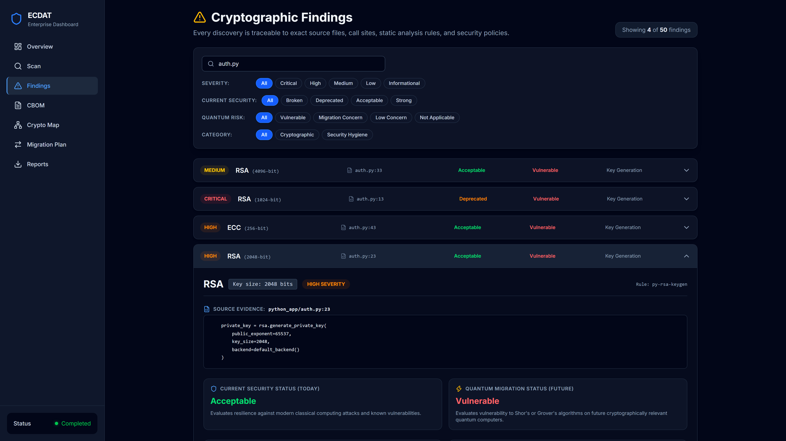
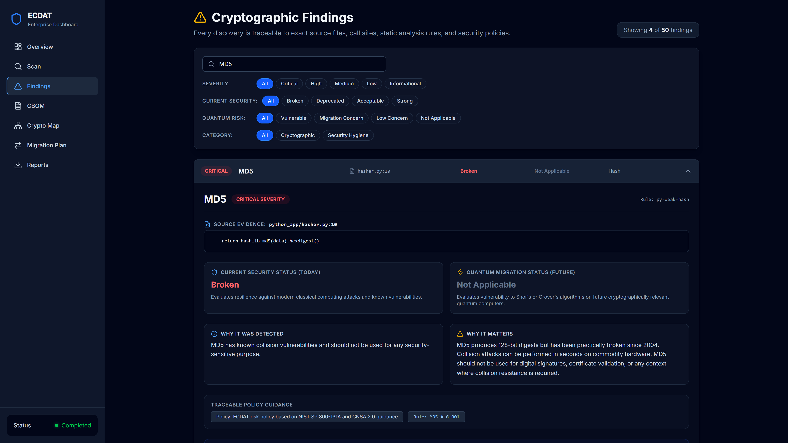
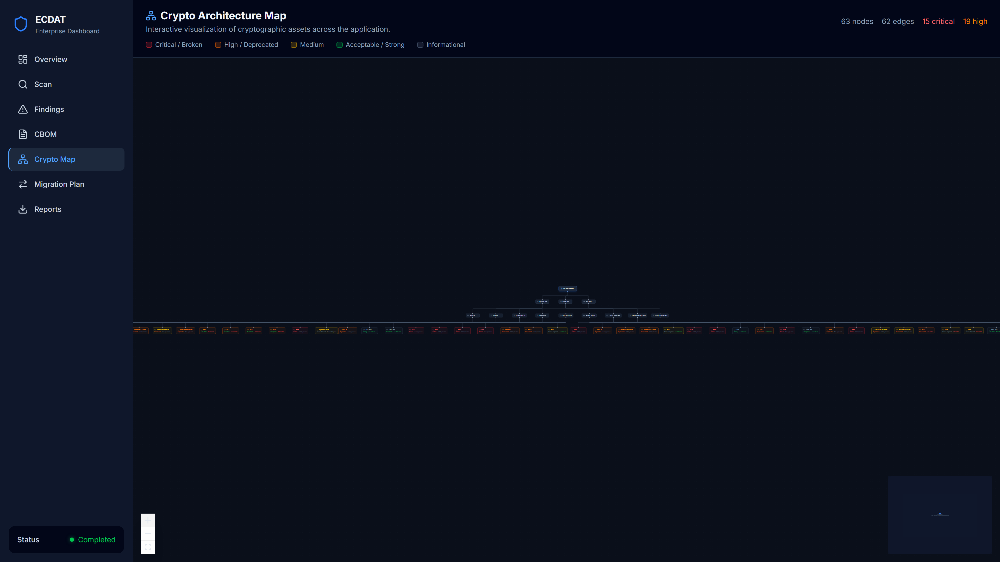
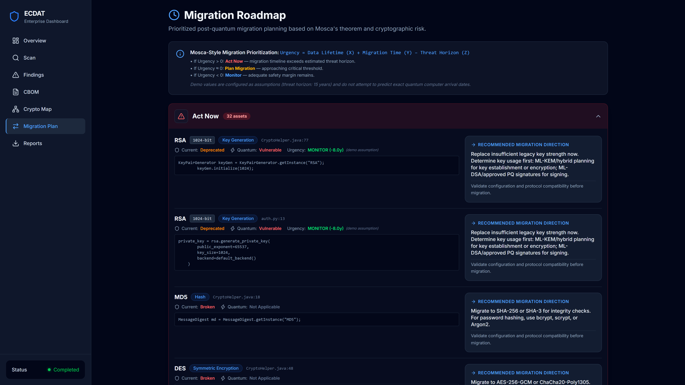
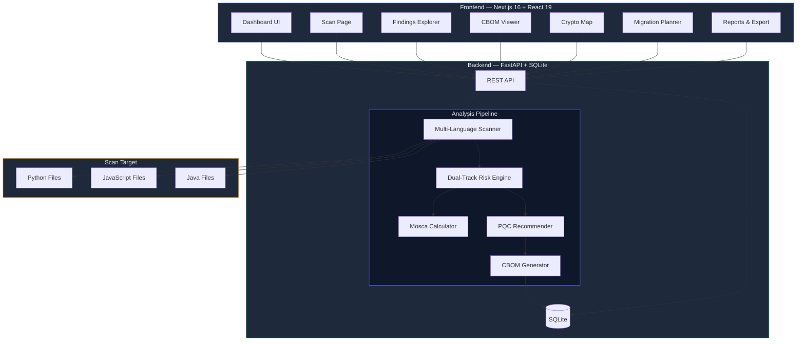

# ECDAT — Enterprise Cryptographic Discovery & Analysis Tool

ECDAT is an explainable cryptographic discovery and migration-planning prototype that scans software repositories, builds a structured cryptographic inventory, separates current security risk from quantum-migration risk, and produces prioritized migration guidance.

---

## Showcase Screenshots

<div align="center">
  <h3>1. Executive Dashboard & Real-Time Discovery Overview</h3>
  
  <p><em>Real metrics from live repository scan: ~50 findings, 15 current criticals, 12 quantum migration concerns across 10 files and 3 languages in ~0.55s.</em></p>
</div>

<br/>

<div align="center">
  <h3>2. Cryptographic Findings & Quantum Risk Drilldown (RSA-2048)</h3>
  
  <p><em>Dual-track risk separation: Acceptable classical status today vs. Vulnerable quantum status tomorrow with full source-code provenance.</em></p>
</div>

<br/>

<div align="center">
  <h3>3. Dual-Risk Concept in Action (MD5 Legacy Hash)</h3>
  
  <p><em>MD5 clearly identified as Broken today classically, with Quantum Risk marked as Not Applicable.</em></p>
</div>

<br/>

<div align="center">
  <h3>4. Interactive Cryptographic Architecture Map</h3>
  
  <p><em>React Flow visualization showing hierarchical mapping: Application → Directories → Files → Cryptographic Primitives.</em></p>
</div>

<br/>

<div align="center">
  <h3>5. Prioritized Migration Roadmap (Mosca-Style Urgency & PQC Guidance)</h3>
  
  <p><em>Urgency tiers (Act Now, Plan Migration, Monitor) based on Mosca's inequality with post-quantum migration directions.</em></p>
</div>

---

## Problem Statement

Organizations rely on cryptographic primitives — hash functions, ciphers, key exchange protocols, digital signatures — embedded across thousands of source files, often using outdated or vulnerable algorithms without awareness. As quantum computing advances, even currently secure public-key algorithms (RSA, ECC, Diffie-Hellman) face theoretical threats from Shor's algorithm.

**The challenge:** Most organizations lack an accurate inventory of the cryptographic primitives actually used in their codebases, cannot distinguish between present-day classical weaknesses and future quantum migration concerns, and have no structured path toward post-quantum readiness.

**ECDAT addresses this** by scanning source code repositories, building a structured cryptographic inventory, separating current-security risk from quantum-migration risk, evaluating migration urgency using Mosca's theorem, and generating actionable migration roadmaps. ECDAT uses explainable static-analysis rules and deterministic policy logic rather than AI-generated security classifications.

---

## Architecture



---

## Key Capabilities

| Capability | Description |
|---|---|
| **Multi-Language Static Scanning** | AST-based Python analysis and rule-based JavaScript/TypeScript and Java pattern matching detect cryptographic usage patterns across codebases |
| **Dual-Track Risk Assessment** | Separates **current security status** (broken / deprecated / acceptable / strong) from **quantum risk status** (vulnerable / migration concern / low concern / not applicable) as independent axes |
| **Mosca-Style Prioritization** | Evaluates migration urgency: if `data_lifetime (X) + migration_time (Y) > threat_horizon (Z)`, migration urgency increases. Threat horizon $Z$ is a configurable planning assumption/scenario, **not a prediction** of quantum-computer arrival |
| **Operation-Aware PQC Guidance** | Suggests migration directions informed by NIST post-quantum standards: RSA/ECDSA signatures map toward ML-DSA (FIPS 204), while key-establishment uses map toward ML-KEM (FIPS 203) or hybrid mechanisms |
| **Structured CBOM Generation** | Produces a Cryptographic Bill of Materials with source provenance — entries traceable to file, line number, and code snippet |
| **Interactive Crypto Map** | Visual dependency graph showing application → directory → file → finding relationships using React Flow |
| **Export Formats** | Structured JSON and CSV export of discovered cryptographic inventory |
| **Deterministic Policy Logic** | Core security classification and migration policy decisions are deterministic and rule-based, informed by established cryptographic guidance (including relevant NIST publications), avoiding LLM-generated security conclusions |

---

## Verified Demo Metrics

The following metrics reflect verified output from the bundled demo repository (`demo_repository/`):

| Metric | Verified Value |
|---|---|
| Total findings | ~50 findings |
| Files scanned | 10 files |
| Languages scanned | Python, JavaScript, Java |
| Bundled demo scan duration | ~0.55 seconds |
| Backend test suite | 91 passed (`pytest`) |
| Frontend test suite | 28 passed (`node --test`) |
| Frontend production build | ✅ Successful (0 TypeScript errors) |

---

## Tech Stack

### Backend
- **Python 3.12+** with **FastAPI** — async REST API
- **SQLAlchemy** — SQLite persistence
- **Pydantic v2** — schema validation and serialization
- **PyYAML** — risk policy definitions
- **AST module** — Python syntax tree and import alias tracking

### Frontend
- **Next.js 16** with App Router
- **React 19** + **TypeScript**
- **Tailwind CSS** — responsive styling
- **Recharts** — data visualization
- **React Flow** (`@xyflow/react`) — interactive cryptographic dependency graph
- **Lucide React** — iconography

---

## Project Structure

```
ecdat/
├── backend/
│   ├── app/
│   │   ├── scanner/         # Multi-language static scanners
│   │   │   ├── python_scanner.py    # AST-based Python analysis
│   │   │   ├── js_scanner.py        # Rule-based JS/TS analysis
│   │   │   ├── java_scanner.py      # Rule-based Java analysis
│   │   │   ├── engine.py            # Scanner orchestration
│   │   │   └── rule_registry.py     # Scanner rule definitions
│   │   ├── risk/
│   │   │   ├── engine.py            # Dual-track risk engine
│   │   │   └── risk_policy.yaml     # Policy rules informed by NIST/CNSA guidance
│   │   ├── recommendations/
│   │   │   ├── engine.py            # PQC recommendation engine
│   │   │   └── mosca.py             # Mosca's theorem calculator
│   │   ├── cbom/
│   │   │   └── generator.py         # CBOM generator (project schema)
│   │   ├── core/
│   │   │   └── models.py            # Data models
│   │   ├── api/
│   │   │   ├── config.py            # Application configuration
│   │   │   ├── database.py          # SQLAlchemy persistence
│   │   │   └── service.py           # Scan service orchestration
│   │   ├── main.py                  # FastAPI application factory
│   │   └── pipeline.py              # End-to-end scan pipeline
│   ├── tests/                       # 91 backend tests
│   └── requirements.txt
├── frontend/
│   ├── app/
│   │   ├── page.tsx                 # Dashboard overview
│   │   ├── scan/page.tsx            # Scan initiation
│   │   ├── findings/page.tsx        # Findings explorer
│   │   ├── cbom/page.tsx            # CBOM viewer
│   │   ├── crypto-map/page.tsx      # Interactive dependency graph
│   │   ├── migration/page.tsx       # Migration roadmap
│   │   └── reports/page.tsx         # Reports & export
│   ├── components/                  # Shared UI components
│   ├── hooks/                       # React hooks (useScan)
│   ├── lib/                         # API client, display formatting
│   ├── types/                       # TypeScript type definitions
│   └── tests/                       # 28 frontend tests
├── demo_repository/                 # Deliberately vulnerable test fixtures
│   ├── python_app/                  # MD5, DES, weak RSA, hardcoded credentials
│   ├── node_app/                    # RC4, deprecated crypto APIs, legacy auth
│   ├── java_app/                    # ECB mode, weak ciphers
│   └── config/                      # Static configuration fixtures
└── docs/
    ├── API.md                       # REST API documentation
    └── screenshots/                 # Showcase screenshots
```

---

## Installation & Setup

### Prerequisites
- **Python 3.12+**
- **Node.js 20+**
- **npm**

### Backend Setup

```powershell
# From repository root
python -m venv .venv
.\.venv\Scripts\python -m pip install -r backend\requirements.txt

# Start the API server
.\.venv\Scripts\python -m uvicorn app.main:app --app-dir backend --host 127.0.0.1 --port 8000
```

### Frontend Setup

```powershell
# From frontend directory
cd frontend
npm install
npm run build
npm start -- -p 3000
```

### Access

| Service | URL |
|---|---|
| Dashboard | http://localhost:3000 |
| API Swagger Docs | http://localhost:8000/docs |
| API Health Check | http://localhost:8000/api/health |

---

## Demo Walkthrough

1. **Open the Dashboard** at `http://localhost:3000`
2. **Click "Scan Demo Repository"** — scans the bundled test repository
3. **Review Scan Progress** — observe real-time pipeline status (Scanning → Assessing Risk → Generating CBOM → Completed)
4. **Explore Findings** — filter and sort ~50 findings by severity, algorithm, language, and dual-axis risk
5. **Inspect the CBOM** — review the structured cryptographic inventory with source provenance
6. **View the Crypto Map** — examine hierarchical relationships from application modules to detected primitives
7. **Examine the Migration Plan** — review findings grouped by Mosca urgency tiers (Act Now / Plan Migration / Monitor)
8. **Export Results** — download structured JSON or CSV data

For detailed technical evaluation steps, see [`DEMO_GUIDE.md`](DEMO_GUIDE.md).

---

## API Reference

See [`docs/API.md`](docs/API.md) for REST API details including:
- Endpoints for scanning, results, CBOM, and roadmap
- Progress polling and status states
- JSON and CSV export formats
- Upload constraints and path security rules

### Quick API Demo

```powershell
# Start a demo scan
$scan = Invoke-RestMethod -Method Post http://localhost:8000/api/scan/demo

# Poll status until COMPLETED
Invoke-RestMethod "http://localhost:8000/api/scan/$($scan.scan_id)"

# Retrieve findings
Invoke-RestMethod "http://localhost:8000/api/findings/$($scan.scan_id)"

# Export CBOM
Invoke-WebRequest "http://localhost:8000/api/export/$($scan.scan_id)?format=json" -OutFile cbom.json
```

---

## How It Works

### Deterministic & Explainable Policy Pipeline

ECDAT uses explainable static-analysis rules and deterministic policy logic rather than AI-generated security classifications:

1. **Scanner** — AST-based analysis (Python) and rule-based pattern matching (JS/Java) identify cryptographic API calls, extracting algorithm names, key sizes, operation types, modes, and padding.
2. **Risk Engine** — A declarative YAML policy file (`risk_policy.yaml`) maps algorithm, operation, and key-size combinations to current-security and quantum-risk statuses. Guidance is informed by established cryptographic standards, including relevant NIST publications.
3. **Mosca Calculator** — Evaluates Mosca's theorem: if $X + Y > Z$, migration urgency increases.
   - $X$ = required data-security lifetime
   - $Y$ = estimated migration time
   - $Z$ = configurable quantum-threat horizon/scenario (a planning assumption, **not a prediction** of quantum-computer arrival)
4. **Recommender** — Suggests operation-aware migration directions based on NIST Post-Quantum Cryptography standards:
   - Digital signatures (RSA, ECDSA) map toward **ML-DSA** (NIST FIPS 204) or **SLH-DSA** (NIST FIPS 205).
   - Key establishment/exchange maps toward **ML-KEM** (NIST FIPS 203) or appropriate hybrid key-establishment schemes.
5. **CBOM Generator** — Compiles findings, risk assessments, and recommendations into a structured cryptographic inventory.

### Dual-Track Risk Model

ECDAT evaluates cryptography along two distinct axes:

| Axis | Focus | Example |
|---|---|---|
| **Current Security** | Resilience against current classical cryptanalysis | MD5 → Broken, AES-256 → Strong |
| **Quantum Risk** | Vulnerability to future quantum algorithms (e.g., Shor's algorithm) | RSA-2048 → Vulnerable, AES-256 → Low Concern |

This model allows an algorithm to be **currently acceptable yet quantum-vulnerable** (such as RSA-2048 for signatures) or **currently broken while quantum-irrelevant** (such as MD5).

---

## Testing

### Backend Tests (91 tests)

```powershell
# From repository root
python -B -m pytest -q -p no:cacheprovider
```

Validates scanner detection, risk classification, Mosca calculation, CBOM generation, pipeline execution, persistence, path boundary checks, and upload validation.

### Frontend Tests (28 tests)

```powershell
# From frontend directory
cd frontend
npm test
```

Validates algorithm display normalization, severity formatting, risk status display, operation type formatting, and Mosca visual cues.

---

## Current Scope / Limitations

- **Source-Code Static Analysis Focus** — Analyzes source code; does not perform runtime memory, network traffic, or compiled binary discovery.
- **Language Coverage** — Python features AST-based parsing with import alias resolution; JavaScript/TypeScript and Java currently use regex and pattern-based heuristic matching, which may yield false positives or false negatives on complex or dynamically constructed calls.
- **Dataflow Depth** — Python analysis tracks direct local variable assignments, but does not perform inter-procedural taint tracking or whole-program dataflow analysis.
- **Configuration & Certificates** — Does not evaluate live TLS handshakes, certificate stores, or external infrastructure configuration.
- **CBOM Format** — Generates a structured cryptographic inventory following the project's internal schema; full CycloneDX Cryptography extension compliance is an area for future standardization.
- **Persistence Architecture** — Built with SQLite for lightweight, single-user local evaluation; not designed for concurrent multi-tenant enterprise deployment.
- **Planning Parameters** — Threat horizon values used in Mosca calculations are configurable planning assumptions, not forecasts of quantum computer development timelines.
- **Authentication** — The local development API operates without authentication and should be run on loopback interfaces.

---

## Future Scope

- Expanding AST-based parsing to Go, Rust, C/C++, and C#
- Integration with CycloneDX (v1.6+) cryptographic BOM standards
- CI/CD pipeline plugins (GitHub Actions, GitLab CI)
- Certificate and TLS endpoint configuration discovery
- Binary and container image static cryptographic scanning
- Multi-user role-based access control and enterprise database backends

---

## Project Context

ECDAT was developed as a software prototype for **Smart India Hackathon 2026** (Problem Statement: SIH26164, National Technical Research Organisation — NTRO) addressing cryptographic discovery, inventory generation, and post-quantum migration planning.

---

## Acknowledgments

- **NIST SP 800-131A Rev. 2** — Transitioning the Use of Cryptographic Algorithms and Key Lengths
- **NIST FIPS 203** — Module-Lattice-Based Key-Encapsulation Mechanism (ML-KEM)
- **NIST FIPS 204** — Module-Lattice-Based Digital Signature Algorithm (ML-DSA)
- **NIST FIPS 205** — Stateless Hash-Based Digital Signature Algorithm (SLH-DSA)
- **CNSA 2.0** — Commercial National Security Algorithm Suite 2.0
- **Michele Mosca** — Theorem and framework for quantum migration risk assessment
